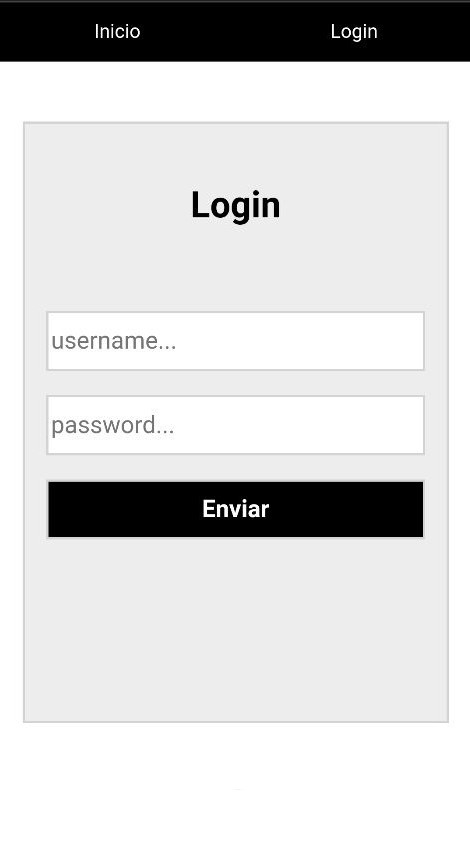
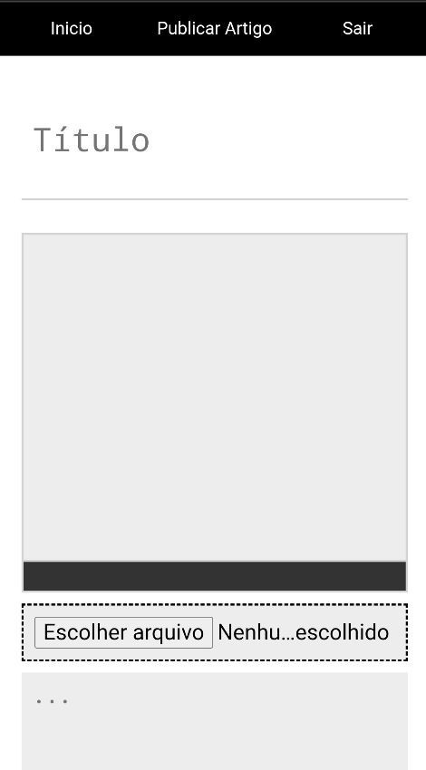

# online-articles

Uma aplicação web em que você pode ler artigos e escrevê-los caso você esteja logado como admin.

## site nos computadores

Aqui a página inicial com os artigos mais recentes.

Aqui a página de um artigo selecionado.

Aqui a página em que o admin pode escrever um novo artigo.

Aqui a página de login.

## site nos dispositivos mobile

  
  
  

